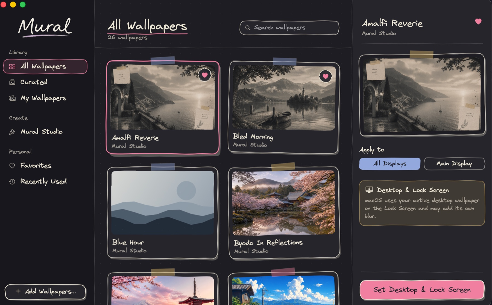

<br />

<p align="center">
  <picture>
    <source media="(prefers-color-scheme: dark)" srcset="public/assets/img/WordmarkDark.png">
    <source media="(prefers-color-scheme: light)" srcset="public/assets/img/WordmarkLight.png">
    
  </picture>
</p>

<p align="center">
  <strong>The little site behind the little app.</strong>
  <br />
  A hand-drawn landing page for <a href="https://github.com/FrederickStempfle/Mural">Mural</a>.
  <br />
</p>

<p align="center">
  
  
  
  
</p>

<p align="center">
  <a href="https://mural-site-cy1.pages.dev/"><strong>→&nbsp; See it live</strong></a>
</p>

<br />

<p align="center">
  
</p>

<p align="center">
  <sub><em>The app this site is here to talk about.</em></sub>
</p>

<br />

---

```sh
npm install
npm run dev      # dev server
npm run build    # → dist/, served by Cloudflare Pages
```

The app itself lives at **[FrederickStempfle/Mural](https://github.com/FrederickStempfle/Mural)**.

<br />

<p align="center">
  
  <br />
  <sub><em>Made for Macs that deserve better backgrounds.</em></sub>
</p>
